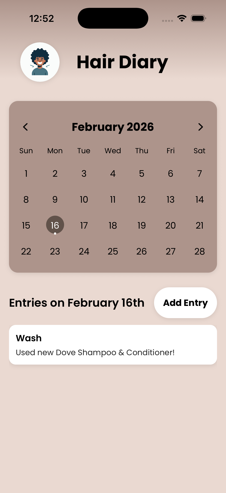
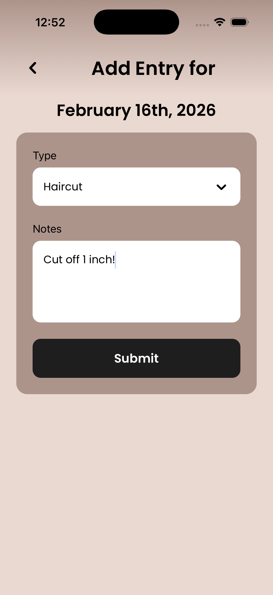

# 💇‍♀️ Hair Diary

An app designed to empower people embrace their hair care in an easy and visual way. It helps track hair care routines, products, and styles. Built with React Native and TypeScript, it helps people achieve their goals of their hair care journey.

## ⚙️ Tech Stack

**Core Technolgies**
- Reach Native
- TypeScript
- Expo

**Key Libraries & Tools**
- React Navigation
- react-native-calendars
- expo-linear-gradient
- expo-font
- expo-splash-screen
- AsyncStorage

## 📋 Prerequisites

Before you begin, ensure you have the following installed.

### Required Software

- **Node.js** (v14.0 or higher)
- **npm** (v6.0 or higher) or **yarn**
- **Git**

## Installation

Once you have the prerequisites installed, follow these steps:

1. **Clone the repository**
```
bash
git clone https://github.com/hecbatista/hairdiary.git
cd hairdiary
```

2. **Install dependencies**
```
bash
npm install
```
or
```
bash
yarn install
```

3. **Start the development server**
```
bash
npm start
```
or
```
bash
npx expo start
```


## 📸 Preview
<p align=center>
    
    
</p>

## 🥅 Goals
- Develop Front-End Skills
- Develop Back-End Skills
- Improve upon code design and documentation
- Learn new technologies

## 🧑🏽‍💻 About me
Built by Hector Batista (a fellow curly head!) - Computer Science & Business Administration

I'm passionate about learning new things while also helping people easily achieve their goals through software solutions.

**Connect with me:**
- 🧳 LinkedIn: [Hector Batista Jr](https://www.linkedin.com/in/hectorbatistajr/)
- 📧 Email: [batista.h@northeastern.edu](mailto:batista.h@northeastern.edu)