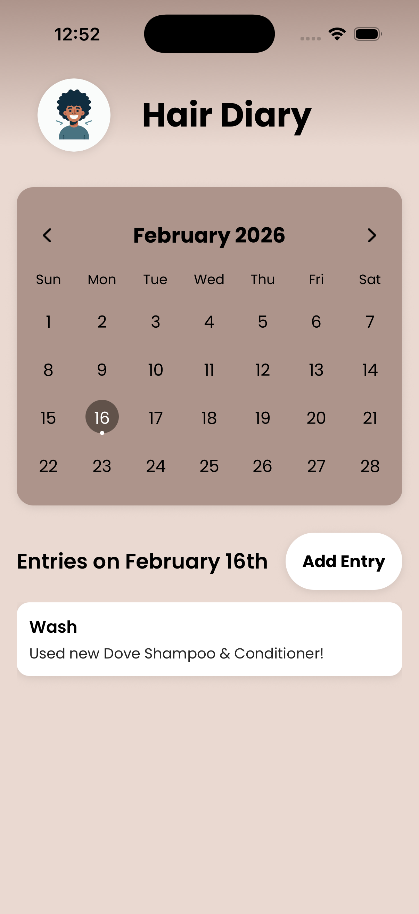
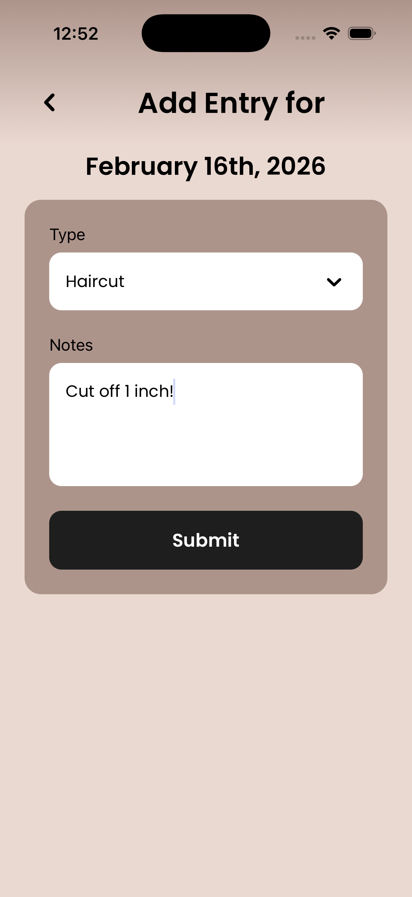
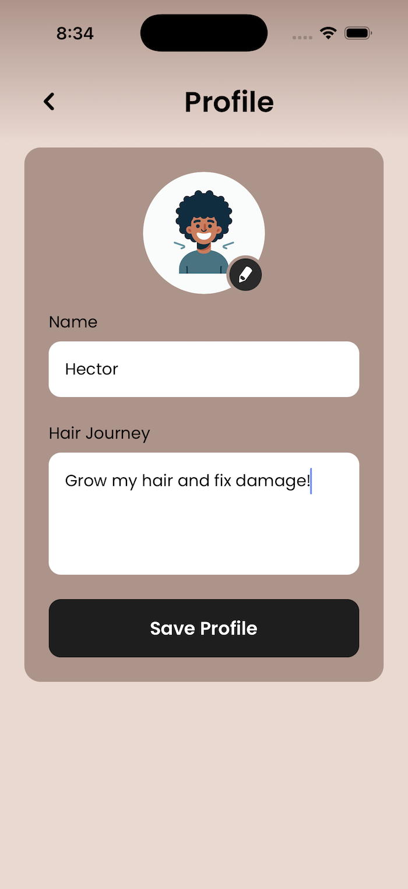

# 💇‍♀️ Hair Diary

An app designed to empower people embrace their hair care in an easy and visual way. It helps track hair care routines, products, and styles. Built with React Native and TypeScript, it helps people achieve their goals of their hair care journey.

## ⚙️ Tech Stack

**Core Technolgies**
- React Native
- TypeScript
- Expo
- Supabase

**Front-End Libraries**
- **React Navigation** - Screen navigation and routing.
- **react-native-calendars** - Interactive calendar component w/ custom styling
- **expo-linear-gradient** - Gradient background
- **expo-font** - Customer typography
- **expo-image-picker** - Profile picture uploads

**Back-End & Database**
- **Supabase Auth** - User authentication & session management
- **Supabase Database (PostgreSQL)** - Relational database w/ RLS policies
- **Supabase Storage** - Cloud storage for Profile Pictures 

## 🏗️ File structure
```
hair-diary/
├── screens/
│   ├── HomeScreen.tsx        # Calendar and entries display
│   ├── AddEntryScreen.tsx    # Entry creation
│   ├── ProfileScreen.tsx     # User profile management
│   └── LoginScreen.tsx       # Authentication
├── lib/
│   ├── supabase.ts           # Supabase client configuration
│   ├── supabaseEntries.ts    # Entry operations
│   └── supabaseProfile.ts    # Profile and storage operations
├── components/
│   ├── form/                 # Reusable form components
│   ├── HeaderGradient.tsx    # Background gradient header component
│   └── ScreenHeader.tsx      # Navigation header
├── utils/
│   ├── dateFormat.ts         # Date formatting utilities
│   └── todayISO.ts           # Date helper functions
└── assets/
    └── fonts/                # Poppins font family
```

## 📋 Prerequisites

Before you begin, ensure you have the following installed.

### Required Software

- **Node.js** (v14.0 or higher)
- **npm** (v6.0 or higher) or **yarn**
- **Git**

## Installation

Once you have the prerequisites installed, follow these steps:

1. **Clone the repository**
```
bash
git clone https://github.com/hecbatista/hairdiary.git
cd hairdiary
```

2. **Install dependencies**
```
bash
npm install
```
or
```
bash
yarn install
```

3. **Start the development server**
```
bash
npm start
```
or
```
bash
npx expo start
```


## 📸 Preview
<p align=center>
    
    
    
</p>

## 🎯 Features
- **User Authentication** - Secure login
- **Calendar-Based Tracking** - Visual interface w/ marked dates
- **Custom Entry Logging** - Record daily routines, styling, and treatments
- **Cloud Data Storage** - Entries sync across devices w/ Supabase
- **Profile Managment** - Upload profile pictures to cloud storage

## 🥅 Goals
- Develop Front-End Skills w/ React-Native
- Develop Back-End Skills w/ Supabase and Expo Routing
- Improve upon code design and documentation
- Learn cloud storage and database integration
- Implement machine learning reommendations

## 🚧 Possible Features
- Good Hair Day Posts w/ used hair products!
- Recommendations to improve hair health!

## 🧑🏽‍💻 About me
Built by Hector Batista (a fellow curly head!) - Computer Science & Business Administration

I'm passionate about learning new things while also helping people easily achieve their goals through software solutions.

**Connect with me:**
- 🧳 LinkedIn: [Hector Batista Jr](https://www.linkedin.com/in/hectorbatistajr/)
- 📧 Email: [batista.h@northeastern.edu](mailto:batista.h@northeastern.edu)